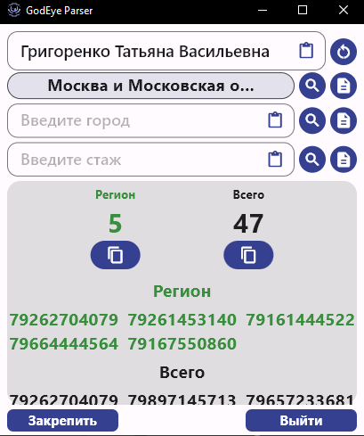
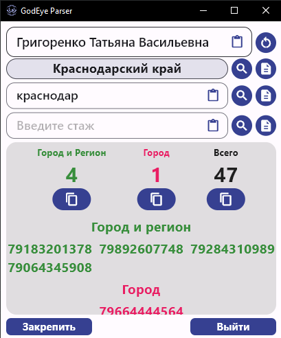
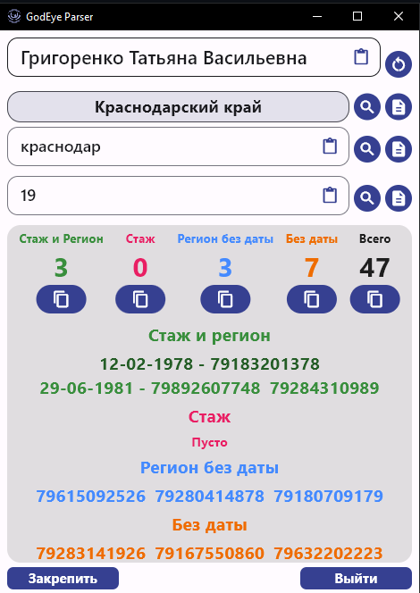
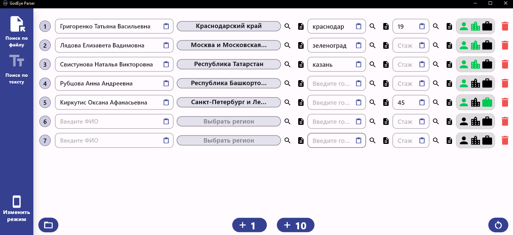

# godeye_parser

**Приложение для парсинга html файла или текста данных Telegram бота "Глаз Бога"**

## Принцип работы
1. Скачайте релиз приложения.
2. Запустите `godeye_parser.exe`.
3. Изначально вас попросят указать папку, в которой будут храниться скачанные файлы с Telegram(по умолчанию это `C:\Users\%USERNAME\Downloads\Telegram Desktop`). Для того, чтобы выбрать путь, нажмите на иконку папки в левом нижнем углу.
4. Если вы хотите искать данные по файлам, то воспользуйтесь вкладкой `Поиск по файлу`. Если же хотите выполнить поиск по тексту, который в боте называется `Поиск по тегу в контактах`, то перейдите на вкладку `Поиск по тексту`.
5. И наконец, пользуйтесь поиском :)

## Основные возможности поиска
- **Поиск номеров телефона по региону**

  

    
Показать скриншот

    

      
    

  

  
- **Поиск номеров телефона по городу**

  

    
Показать скриншот

    

      
    

  

  
- **Поиск конкретных людей и их номеров телефона по стажу работы(если человек - врач)**  
  P.S. чем ярче цвет - тем ближе дата рождения ко стажу)
  
  

    
Показать скриншот

    

      
    

  

## Варианты окна поиска
- На скриншотах выше показано малое окно поиска лишь для одного файла. Сделано было специально, чтобы, имея возможность закрепить окно, постоянно не разворачивать/сворачивать его, а делать все с максимальной скоростью и удобством.
- Если вам необходима таблица с файлами, чтобы сохранять изменения поиска для каждого файла соответственно, то существует второе окно поиска.
Для того, чтобы переключаться между режимами, воспользуйтесь кнопкой `Изменить режим` в левом нижнем углу

## О приложении

### Стек технологий(пакетов)
- bloc
- get_it
- sqflite
- freezed
- go_router
- shared_preferences
- window_manager
- dropdown_search
- ~~ранее был реализован поиск по api через dio, но в угоду скорости пришлось от него отказаться~~
